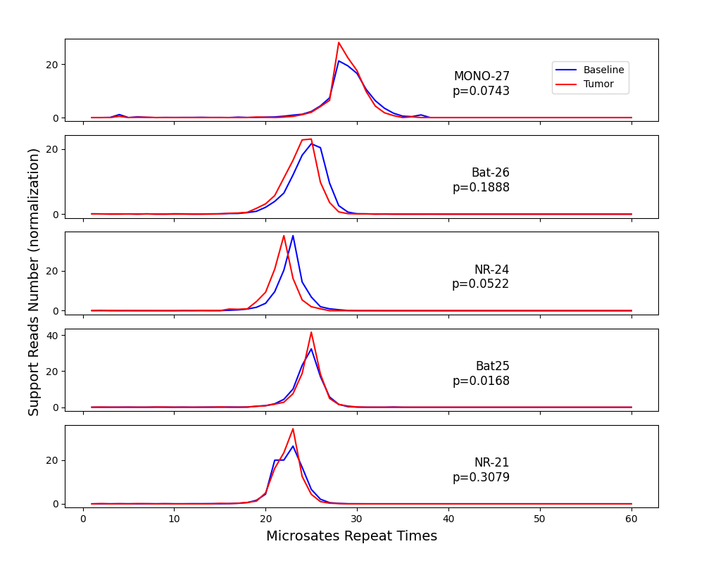
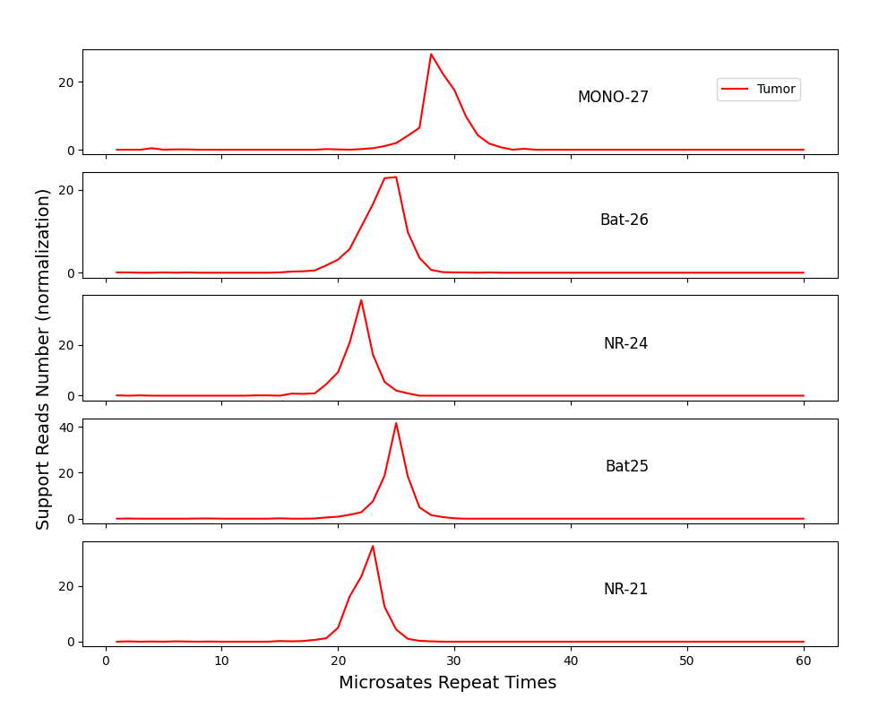

本脚本的大量代码来自于 Mantis2/Mantis ，感谢 Mantis2/Mantis 的作者。

另外也感谢达安基因，这个图片是对他们展示结果的复刻，但他们的分析代码是非开源的。

[EN](README_EN.md)

## 环境

```

pip install -r requirements.txt

#测试环境python==3.12.8，低版本运行可能有影响

#也可以通过apptainer构建镜像
#需要将项目下载到本地后

cd env_apptainter
apptainer build  msircvisual.sif  ./msircvisual.def

# 运行
apptainer run  msircvisual.sif  get_rc_distribution_baseline
apptainer run  msircvisual.sif  msircvisual
```

## 运行方式

### 1. tumor-normal 绘图

```
python msircvisual.py  -t tumor.bam \
-n normal.bam  -b source/msi.bed  -o test/test.png --genome human_g1k_v37_decoy.fasta
```

### 2. 单样本绘图(带有基线)

- 获取基线

```
python get_rc_distribution_baseline.py  -n  *.normal.bam \
-b source/msi.bed \
--genome human_g1k_v37_decoy.fasta \
-o source/msircvisual_baseline.txt
```

- 运行 msircvisual.py

```
python msircvisual.py  -bsl source/msircvisual_baseline.txt  -t tumor.bam -b source/msi.bed -o test/test.png --genome human_g1k_v37_decoy.fasta
```

### 3. 单样本绘图(无基线)

```
python msircvisual.py  -t tumor.bam -b source/msi.bed -o test/test-tumor.png --genome human_g1k_v37_decoy.fasta
```

### bed 文件要求

bed 文件的第四列需要注意：

需包含 repeating k-mer 与 repeat count 以及 repeat name，用括号括起来，例如：(T)28[MONO-27]

```
2	39564893	39564921	(T)28[MONO-27]
```

demo 见 [msibed](./source/msi.bed)

## 结果展示





## 参数

msircvisual.py

- normal：正常样本的 bam 文件
- baseline：基线的 tsv 文件，
- tumor：tumor 样本的 bam 文件，必须
- bedfile：bed 文件，必须
- output：输出的 png 文件，必须
- mrn：最大的重复次数，超过这个次数将不被统计，默认 60
- mrq：最小的平均质量值，参考 mantis2
- mlq：最小的平均 locus 质量值，参考 mantis2
- mrl：最小的读长，参考 mantis2
- threads：线程数
- genome：参考基因组文件
- debug_output：是否打印 debug 信息，参考 mantis2

## 其它

关于 Mann-Whitney U 检验的获取 p 值的部分，或许存在一些统计上的不严谨，抱歉我确实不擅长这些。

## 版权声明

本项目基于 [MANTIS2](https://github.com/nh13/MANTIS2)开发，遵循 GPLv3 许可证。
