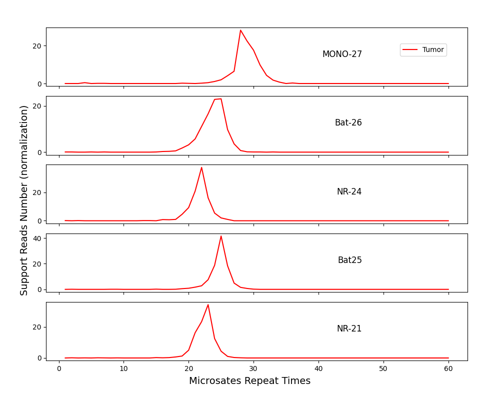

## Acknowledgements

A large portion of the code in this script is derived from Mantis2. We would like to express our gratitude to the authors of Mantis2.
Additionally, we would like to thank DAAN Gene. The image in this project is a replication of their results. However, their analysis code is not open-source.

### Environment

```
pip install -r requirements.txt

# Tested environment: python==3.12.8. Running with lower versions may cause issues.
```

## Usage

1. Tumor-Normal Plotting

```
python msircvisual.py  -t tumor.bam \
-n normal.bam  -b source/msi.bed  -o test/test.png --genome human_g1k_v37_decoy.fasta
```

2. Single Sample Plotting (with Baseline)
   Obtain Baseline

```
python get_rc_distribution_baseline.py  -n  *.normal.bam \
-b source/msi.bed \
--genome human_g1k_v37_decoy.fasta \
-o source/msircvisual_baseline.txt
```

Run msircvisual.py

```
python msircvisual.py  -bsl source/msircvisual_baseline.txt  -t tumor.bam -b source/msi.bed -o test/test.png --genome human_g1k_v37_decoy.fasta
```

3. Single Sample Plotting (without Baseline)

```
python msircvisual.py  -t tumor.bam -b source/msi.bed -o test/test-tumor.png --genome human_g1k_v37_decoy.fasta
```

## Requirements for BED File

The fourth column of the BED file requires special attention:
It should contain the repeating k-mer, repeat count, and repeat name, enclosed in parentheses, for example: (T)28[MONO-27]

```
2	39564893	39564921	(T)28[MONO-27]
```

A demo can be found at [msibed](./source/msi.bed)

## Output




## Parameters

```
msircvisual.py

normal: BAM file for the normal sample.
baseline: TSV file for the baseline.
tumor: BAM file for the tumor sample (required).
bedfile: BED file (required).
output: Output PNG file (required).
mrn: Maximum repeat number. Repeats exceeding this number will not be counted (default: 60).
mrq: Minimum average quality value (refer to Mantis2).
mlq: Minimum average locus quality value (refer to Mantis2).
mrl: Minimum read length (refer to Mantis2).
threads: Number of threads.
genome: Reference genome file.
debug_output: Whether to print debug information (refer to Mantis2).
```

## Other Notes

Regarding the Mann-Whitney U test for obtaining p-values, there may be some statistical inaccuracies. I apologize as I am not proficient in this area.

## Copyright Statement

This project is developed based on [MANTIS2](https://github.com/nh13/MANTIS2) and follows the GPLv3 license.
